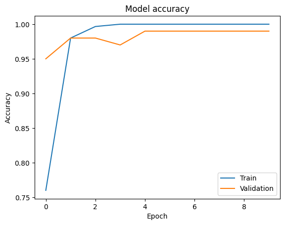

# Human Action Classification Using CNNs

This project focuses on:

- Training CNN models using transfer learning for the classification of videos of human actions.
- Utilizing the well-known UCF101 - Action Recognition Data Set.
- Comparing the efficiency and performance of three pretrained neural network models: EfficientNet, MobileNet, and ResNet.

## Table Of Contents

- [The Data Set](#the-ucf-101-data-set)
- [How to Use the Notebooks](#usage)
- [Model Comparison - EfficientNet, MobileNet, ResNet](#compare-different-models)

## The UCF 101 Data Set

UCF101 is an action recognition data set of realistic action videos, collected from YouTube, having 101 action categories. This data set is an extension of UCF50 data set which has 50 action categories.

With 13320 videos from 101 action categories, UCF101 gives the largest diversity in terms of actions and with the presence of large variations in camera motion, object appearance and pose, object scale, viewpoint, cluttered background, illumination conditions, etc, it is the most challenging data set to date. As most of the available action recognition data sets are not realistic and are staged by actors, UCF101 aims to encourage further research into action recognition by learning and exploring new realistic action categories.

Data Set Details

The videos in 101 action categories are grouped into 25 groups, where each group can consist of 4-7 videos of an action. The videos from the same group may share some common features, such as similar background, similar viewpoint, etc.

The action categories can be divided into five types:

    Human-Object Interaction
    Body-Motion Only
    Human-Human Interaction
    Playing Musical Instruments
    Sports

## Usage

This project provides a comprehensive guide to training CNN models using transfer learning, calculating performance, and making predictions for the classification of videos of human actions. The detailed implementation and instructions can be found within each notebook in the repository:

- [EfficientNet Notebook](notebooks/01-efficientnet.ipynb)
- [MobileNet Notebook](notebooks/02-mobilenet.ipynb)
- [ResNet Notebook](notebooks/03-resnet.ipynb)

Trained models can also be used to make predictions on video other than the UCF 101 data set even on ones crated by the user:

## Compare Different Models

### 1.EfficientNet
#### Training - EfficientNet

#### Loss & Accuracy vs Iteration - EfficientNet

 

#### Confusion Matrix - EfficientNet

### 2.MobileNet
#### Training - MobileNet

#### Loss & Accuracy vs Iteration - MobileNet

 

#### Confusion Matrix - MobileNet

### 3.ResNet
#### Training - ResNet

#### Loss & Accuracy vs Iteration - ResNet

 

#### Confusion Matrix - ResNet

## Copyright & Acknowledgement

Notice: This notebook includes code authored by the creators of TensorFlow, as featured in TensorFlow Tutorials. The notebook also includes content taken from UCF101 web page.
<table class="tfo-notebook-buttons" align="left">
  <td>
    <a target="_blank" href="https://www.tensorflow.org/tutorials">TensorFlow Tutorials</a>
  </td>
  <td>
    <a target="_blank" href="https://www.crcv.ucf.edu/research/data-sets/ucf101/">UCF101</a>
  </td>
</table>